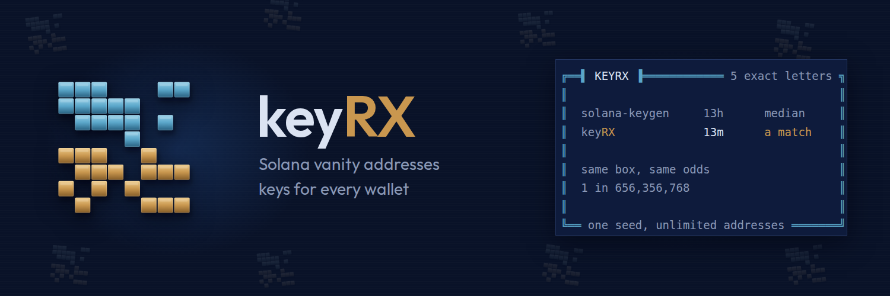

  

  <em>Solana vanity addresses in minutes, not hours.</em> 
  One seed · walk the account index · every match written once, mode 0600 · verified against solana-keygen

  
  
  

# keyRX

**KEYRX, five exact letters, 1 in 656,356,768. `solana-keygen grind` at its 13,600/sec:
a 13-hour median. keyRX: 13 minutes, a match.** Same machine, same odds - measured, not
estimated. (A five-letter grind the old way ran 50 hours here and found nothing.)

Solana BIP39 vanity address grinder. Standalone terminal tool — no daemon,
no service, no network. Replaces `solana-keygen grind --use-mnemonic`.

Why it is fast: one mnemonic yields unlimited addresses. Derive to
m/44'/501' once, then walk the account index; each extra candidate costs
two HMAC-SHA512 ops and one Ed25519 scalar mult instead of 2048 rounds of
PBKDF2. Suffix matching needs only the last N base58 characters.

    cargo install keyrx                                                 # from crates.io
    RUSTFLAGS="-C target-cpu=native" cargo install --path .             # from a clone, tuned to this CPU

    keyrx                                                               # start screen: every command and flag, explained
    keyrx verify                                                        # run first, always
    keyrx bench --indices 128                                           # measures AND saves the rate estimate uses
    keyrx estimate --ends-with MINT                                     # measured; what --ignore-case and --indices 128 buy
    keyrx grind --ends-with MINT --words 12 --indices 8 --out mint.txt  # Phantom
    keyrx grind --ends-with MINT --indices 128 --out mint.txt           # Solflare
    keyrx show MINT --keys                                              # the private key, for Phantom 'Import Private Key'

While grinding, one line rewrites in place every 2s: candidates tried, rate,
elapsed, time to the 50% and 90% marks. Every match prints its address, path
and the exact wallet import steps for that path style and index.

## The site

`site/index.html` is keyrx.tech - one self-contained file (font subset
embedded, zero external requests) that renders the CLI's own panels and runs a
real toy grind in a Web Worker: real random keys, real base58, the address
shown and nothing kept. Two grids (78 desktop / 42 phone); every framed line
is measured by `node tests/site_harness.js site/index.html`.

## The look

Double-line frames with title tabs, an `ink` palette (healthy is hueless
grey; amber at 70%, rose at 90%), gauge bars in `█▌░`. Every
framed line is measured in tests - the width invariant is asserted, never
eyeballed. Colour drops out entirely when stdout is not a terminal.

## Verified on 2026-08-16

- `keyrx verify`: 50,000 pubkeys × 10 suffix lengths OK; derivation deterministic.
- **solana-keygen cross-check: identical** at both path styles for the
  `[7u8; 32]` test entropy — `8zzKEAB4Vqn…UQPh1j` (m/44'/501'/0'/0') and
  `2Ju5fiKYKf4…NjAnKo` (m/44'/501'/0'). Both are pinned as `#[test]`s.
- **A ground hit imports**: `grind --ends-with ab --indices 8` found a match
  in 0.15s and `solana-keygen pubkey "prompt://?full-path=m/44'/501'/6'/0'"`
  with that mnemonic returned the identical address.
- Bench (28 threads): 265,863/sec at 64 indices (19.5× the 13,600 baseline),
  331,793/sec at 128 (24.4×), 437,811/sec at 256 (32.2×). Per core: 9,495–15,636
  vs 284 baseline (33–55×).
- `cargo clippy --all-targets` clean; 10 tests green.

## Secrets

Seed phrases never reach stdout, logs or panic output by default. Matches
go to a mode-0600 file (`--out`). `--show-seed` is opt-in. If the match
file cannot be written, the seed goes to `<out>.recovered` (also 0600); if
that fails too the grind STOPS and prints address+path only — never the
seed. Entropy, seed and derived key material are zeroized.

Test only with 2-character targets. No mnemonic in any fixture, snapshot or
committed file: the two pinned addresses derive from public constant entropy
and are worthless by construction.

## Which wallet, which flags

Every match writes five lines: `address`, `path`, `seed` (12 or 24 words -
restores the whole tree), `privkey` (the base58 64-byte keypair - what
**Phantom "Import Private Key"** pastes) and `keypair` (the same 64 bytes as a
JSON array `[1,2,...]` - what **Solflare** and `solana-keygen` import). A key
import lands on the exact address in one paste as a standalone account - the
index never matters, so grind wide (`--indices 128`). Standalone means a seed
will not recover it: the match file *is* the backup. Verified both ways: a
ground base58 key converted to bytes, and the JSON line copied verbatim, each
fed to `solana-keygen pubkey` print the identical address.

Importing the **seed** instead puts the address inside a recoverable HD wallet.
Solflare takes the exact path the match printed. Phantom does not take a path -
it reaches account N by clicking "add account" N times - so a seed-into-Phantom
grind should use `--indices 8`. `--words` defaults to 12 (what Phantom
generates); every major wallet imports 12 or 24.

## Where matches go

`~/.local/share/keyrx/matches/` (or `$XDG_DATA_HOME/keyrx/matches/`), a
mode-0700 directory of its own - never the current directory. Each file is
mode 0600 and named after the pattern: `--ends-with MINT` -> `MINT.txt`,
`--ignore-case` -> `MINT.ic.txt`, several patterns join with `+`. `--out`
overrides. `keyrx show` lists the files; `keyrx show MINT` reads one
(`--seeds` / `--keys` reveal the secrets).

## Known behaviour (unchanged from the reference, by instruction)

`--count N` may return slightly more than N matches: several threads can
hit before the stop flag propagates. Every extra match is written and
valid. Phantom walks account indices sequentially when adding accounts, so
keep `--indices` low if Phantom is the target; Solflare takes custom paths.

## Licence and name

MIT — use it, fork it, ship it, sell it. The code is yours under that licence, and
with it the look: anyone may build a grinder that frames its panels the same way.
The **name**, the **capsule mark**, and the files under `assets/` are not part of
the grant — see [TRADEMARK.md](TRADEMARK.md) and `assets/LICENSE`. Forks rebrand.
